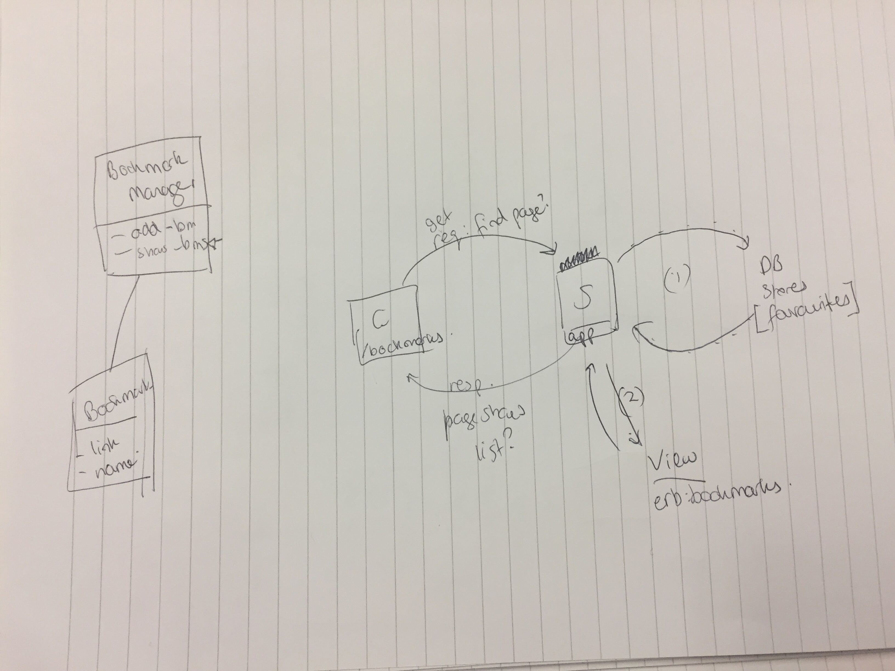

# bookmark-manager
```
As a user,
So I can easily find the pages I like,
I want the bookmark manager to show a list of bookmarks.
```


```
As a time-pressed user
So that I can save a website
I would like to add the site's address and title to bookmark manager
```


Instructions to set up database and test database
----
1. Connect to psql
2. Create and connect to database:
```
admin=# CREATE DATABASE bookmark_manager;
admin=# \c bookmark_manager
```
3. Run query in file 01_create_bookmarks_table.sql
4. Create test database:
```
admin=# CREATE DATABASE bookmark_manager_test;
```
Run query in file 01_create_bookmarks_table.sql again.
